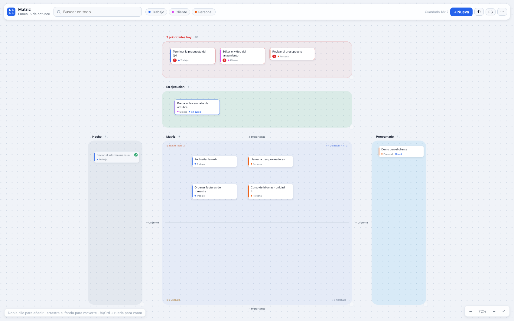

# Matriz — pizarra de tareas para Mac

[English](README.md) | **Español**

Una pizarra infinita para ordenar el día: lo que tiene que caer hoy, lo que
estás haciendo, lo que programas, lo que delegas y lo que ignoras. Todo se
guarda en tu ordenador. Sin cuenta, sin servidor y sin suscripción.

La interfaz habla **español e inglés** — cambia al momento con el botón
ES/EN de la barra.



Es la herramienta que usamos a diario en [DaybyDay Consulting](https://www.daybydayconsulting.com)
y la compartimos tal cual.

## Las zonas

Las tarjetas se mueven con el ratón y cambian de estado según dónde las sueltes:

| Zona | Para qué |
| --- | --- |
| **3 prioridades hoy** | Lo que tiene que quedar hecho hoy sí o sí. Se numera por su orden (1, 2, 3) y avisa en rojo si metes más de tres. |
| **En ejecución** | Lo que estás haciendo ahora mismo. |
| **Matriz** | El clásico de Eisenhower: Ejecutar / Programar / Delegar / Ignorar, según dónde caiga la tarjeta. |
| **Programado** | Lo que tiene fecha. Se puede exportar a tu calendario (.ics, Google Calendar, Outlook). |
| **Hecho** | Lo completado. Se puede archivar de golpe. |

Cada tarjeta puede llevar proyecto, fecha, notas y subtareas con su barra de
progreso. El buscador (tecla `/`) mira en títulos, proyectos, notas y
subtareas a la vez.

## Usarla en el navegador (2 minutos)

1. Descarga [`matriz.html`](matriz.html).
2. Ábrelo con doble clic (Chrome, Safari, el que uses).
3. Doble clic sobre la pizarra y a escribir.

No hay nada que instalar: es un solo archivo sin dependencias. Si quieres,
lo editas.

## App para Mac

La app es un envoltorio nativo del mismo `matriz.html` (WKWebView), con su
icono en el Dock y ventana propia. Hay instrucciones con capturas en
[daybydayconsulting.com/tools/matriz](https://www.daybydayconsulting.com/tools/matriz/).

1. Descarga `Matriz.dmg` desde [Releases](../../releases).
2. Arrastra Matriz a la carpeta Aplicaciones.
3. Crea la carpeta `Documents/Matriz` y copia dentro el `matriz.html` que
   viene en el disco:

   ```bash
   mkdir -p ~/Documents/Matriz && cp /Volumes/Matriz/matriz.html ~/Documents/Matriz/
   ```

4. Abre Matriz. La primera vez macOS pedirá permiso (la app no está
   notarizada): Ajustes del Sistema → Privacidad y seguridad → *Abrir
   igualmente*. O en Terminal: `xattr -cr /Applications/Matriz.app`.

> La pizarra vive en `~/Documents/Matriz/matriz.html`. Editar ese archivo es
> la forma de personalizarla o actualizarla.

## Gestos y atajos

- **Doble clic** en el lienzo: nueva tarea.
- **Arrastrar tarjetas**: moverlas. La zona decide: soltarla en Hecho la marca
  como hecha, en la Matriz coge el cuadrante que le toca.
- **Rueda / dos dedos**: desplazarse. **⌘ + rueda**: zoom. **`0`**: encajar todo.
- **`/`**: buscar. **Enter**: saltar al siguiente resultado.
- **`n`**: nueva tarea. **Espacio + arrastrar**: mover el lienzo.
- **Un clic** en una tarjeta: su detalle (proyecto, fecha, notas, subtareas).

## Tus datos

- Se guardan en el almacenamiento local de la app (y en el navegador, si usas
  la versión web). Nada sale de tu ordenador.
- `⋯ → Exportar copia (.json)` e `Importar copia`: el respaldo completo.
- ¿Vienes de la versión de Chrome? `exportar-matriz.html` genera el JSON y
  `Matriz.app/Contents/MacOS/Matriz --import backup.json` lo mete en la app.

## Estructura del repositorio

```
matriz.html            La pizarra completa (HTML + CSS + JS, sin dependencias)
exportar-matriz.html   Utilidad para exportar el almacenamiento del navegador
captura.png            Captura (inglés) para el README principal
captura-es.png         Captura (español)
README.es.md           Este readme
```

## Novedades

**2.2 — 5 de octubre de 2026**
- Interfaz completa en **inglés y español**, conmutables con el botón ES/EN
  (de inicio, según el idioma del navegador o de la app).

**2.1 — 5 de octubre de 2026**
- Zona *3 prioridades hoy*: numeración automática por posición y aviso en rojo
  si pasas de tres.
- Zona *En ejecución*, para lo que estás haciendo ahora.
- Las pizarras existentes se migran solas al abrir: no se pierde nada.

**2.0 — septiembre de 2026**
- Primera versión de la app nativa para Mac.

## Licencia

MIT (ver [LICENSE](LICENSE)). La marca DayByDay y el icono de la app son de
DaybyDay Consulting y no están cubiertos por la licencia.
