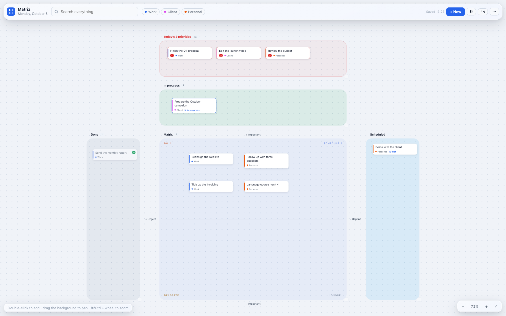

# Matriz — a task board for Mac

**English** | [Español](README.es.md)

An infinite board to sort your day: what must get done today, what you're
working on, what you schedule, what you delegate and what you ignore.
Everything is stored on your Mac. No account, no server, no subscription.

The interface speaks **English and Spanish** — switch on the fly with the
ES/EN button in the toolbar.



It's the tool we use daily at [DaybyDay Consulting](https://www.daybydayconsulting.com),
shared as is.

## The zones

Cards are dragged with the mouse and change state depending on where you
drop them:

| Zone | What it's for |
| --- | --- |
| **Today's 3 priorities** | What must be done today no matter what. Numbered in order (1, 2, 3), with a red warning if you go past three. |
| **In progress** | What you're working on right now. |
| **Matrix** | The classic Eisenhower grid: Do / Schedule / Delegate / Ignore, based on where the card lands. |
| **Scheduled** | What has a date. Exports to your calendar (.ics, Google Calendar, Outlook). |
| **Done** | What you finished. Can be archived in one go. |

Every card can carry a project, date, notes and subtasks with a progress
bar. The search box (key `/`) looks into titles, projects, notes and
subtasks at once.

## Use it in the browser (2 minutes)

1. Download [`matriz.html`](matriz.html).
2. Open it with a double click (Chrome, Safari, whatever you use).
3. Double-click on the board and start writing.

Nothing to install: it's a single file with no dependencies. Edit it if
you feel like it.

## Mac app

The app is a native wrapper around the same `matriz.html` (WKWebView),
with its own icon in the Dock and its own window. There are instructions
with screenshots at
[daybydayconsulting.com/tools/matriz](https://www.daybydayconsulting.com/tools/matriz/).

1. Download `Matriz.dmg` from [Releases](../../releases).
2. Drag Matriz to the Applications folder.
3. Create the `Documents/Matriz` folder and copy `matriz.html` from the
   disk into it:

   ```bash
   mkdir -p ~/Documents/Matriz && cp /Volumes/Matriz/matriz.html ~/Documents/Matriz/
   ```

4. Open Matriz. The first time, macOS will ask for permission (the app
   isn't notarized): System Settings → Privacy & Security → *Open Anyway*.
   Or in Terminal: `xattr -cr /Applications/Matriz.app`.

> The board lives in `~/Documents/Matriz/matriz.html`. Editing that file
> is how you customize or update it.

## Gestures & shortcuts

- **Double-click** on the canvas: new task.
- **Drag cards** around. The zone decides: drop one in Done and it's
  marked as done, in the Matrix it takes the quadrant it lands in.
- **Wheel / two fingers**: pan. **⌘ + wheel**: zoom. **`0`**: fit everything.
- **`/`**: search. **Enter**: jump to the next result.
- **`n`**: new task. **Space + drag**: pan the canvas.
- **One click** on a card: its details (project, date, notes, subtasks).

## Your data

- Stored in the app's local storage (or the browser's, if you use the web
  version). Nothing leaves your computer.
- `⋯ → Export backup (.json)` and `Import backup`: the full backup.
- Coming from the Chrome version? `exportar-matriz.html` generates the
  JSON and `Matriz.app/Contents/MacOS/Matriz --import backup.json` loads
  it into the app.

## Repository layout

```
matriz.html            The whole board (HTML + CSS + JS, no dependencies)
exportar-matriz.html   Helper to export the browser's local storage
captura.png            Screenshot (English) for this README
captura-es.png         Screenshot (Spanish)
README.es.md           Readme in Spanish
```

## Changelog

**2.3 — October 5, 2026**
- **Liquid glass control layer**: the toolbar, panels, menus, toasts and
  modals now use an iOS 26-style glass surface (satin border highlights,
  deeper blur, a sheen that follows the cursor on the toolbar and zoom
  bar, and elastic press on every control). Cards and zones stay clean
  and readable — glass belongs to the navigation layer only.
- Inspired by the design language of `liquid_glass_widgets` (Flutter).

**2.2 — October 5, 2026**
- Full **English + Spanish interface**, switchable with the ES/EN button
  (per browser/app language on first run).

**2.1 — October 5, 2026**
- *Today's 3 priorities* zone: automatic numbering by position and a red
  warning when you go past three.
- *In progress* zone for what you're doing right now.
- Existing boards migrate by themselves on open: nothing is lost.

**2.0 — September 2026**
- First release of the native Mac app.

## License

MIT (see [LICENSE](LICENSE)). The DaybyDay brand and the app icon belong
to DaybyDay Consulting and are not covered by the license.
